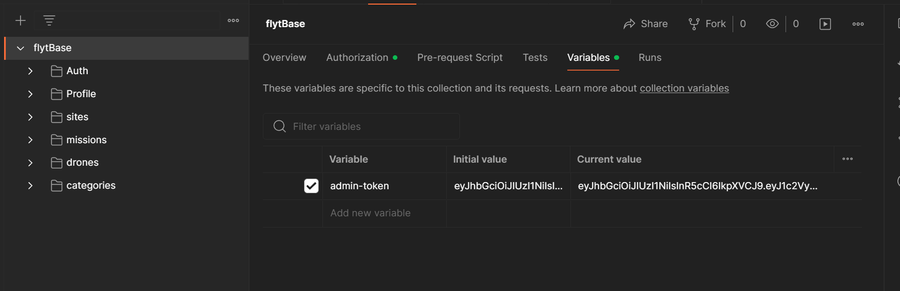

## Docker container 
```
docker pull arpit078/flytbase
docker run -p 3000:3000 arpit078/flytbase

```
Then open postman ->

## Postman collection -> 
https://www.postman.com/arpit078/workspace/flytbase-assignment/collection/33492058-b538ac80-3f60-40d3-97ac-7429221a7138


## Local Installation
```
npm i
npm start
```
--------------------------------------------------------
# API Documentation
--------------------------------------------------------
# Auth
- Both the routes in this collection return a success/failure message and are accompanied by a JWT Token that is used to authenticate for other routes.

- email field is set to be unique for every new user.
## /auth/signup

- Sample request body
```
    {
    "name":"admin",
    "email" : "admin@flytbase.com",
    "password":"root"
    }

```
    
## /auth/login

- Sample request body
```
  { 
   "email" : "admin@flytbase.com",
   "password":"root"
  }
```
------------------------------------------------------------------------------------------
## Following routes are protected by jwt authentication. For testing purpose a valid token(valid for 60d) has been used throughout the collection and has been stored in the postman collection as a variable{{admin-token}}. It can be viewed and edited from -

------------------------------------------------------------------------------------------

# Profile
- Has only one request in the collection.
- supports data exchange using jwt. 
- returns relevant user data
## /profile
- get request
- Sample response object
```
{
    "_id": "65ede8fecf0e85f8f1707781",
    "name": "admin",
    "email": "admin@flytbase.com",
    "passwordHash": "$2b$10$ZP6.QSEMDJoL2cKG/cF.SOE0GAbjL4dZjCH4y8hao2Ybmcs6uRW1u",
    "sites_id": [
        "65edeed31701522371be9739"
    ],
    "__v": 0
}
```

# Sites
- Has four routes for CRUD operations in the sites database of a particular user.
- site schema
```
const siteSchema = new Schema({
 "site_name": {type:String,required:true},
 "user_id":String,
 "position": {
    "latitude": String,
    "longitude": String
 },
 "missions_id":{type:[String],default:[]},
 "drones_id":{type:[String],default:[]}
});
```

## /sites/add
- post request

- sample request object
```
{
"site_name": "Berlin",
"position": {
    "latitude": "18.324643",
    "longitude": "72.654621"    
    }
}
```
- sample response object
- mission_id and drones_id arrays can be filled by creating missions and drones using the subsequent routes. 
```
{
    "creating_user_id": "65ede8fecf0e85f8f1707781",
    "created_site_id": "65edf12f1701522371be9744"
}
```

## /sites/update
- put request
- takes id of the site to be changed

- sample request object
```
{
    "_id":"65edf12f1701522371be9744",
    "update" : {"site_name":"pune"}
}
```
- sample response object
```
{
    "updated_site_id": "65edf12f1701522371be9744"
}
```
## /sites
- get request
- returns all the sites under a given user.
- sample response object
```
[
    {
        "position": {
            "latitude": "18.324643",
            "longitude": "72.654621"
        },
        "_id": "65edf12f1701522371be9744",
        "site_name": "Berlin",
        "user_id": "65ede8fecf0e85f8f1707781",
        "missions_id": [],
        "drones_id": [],
        "__v": 0
    }
]
```

## /site/delete
- delete request
- removes the site from the database.
- sample request obj
```
{"_id":"65edeed31701522371be9739"}
```
- sample response obj
```
{
    "deleted_site_id": "65edeed31701522371be9739"
}
```
----------------------------------------------------------------------------------------------

# Missions
- Missions schema
```
const wayPointSchema = new Schema({
    "alt":Number,
    "lat":Number,
    "lng":Number,
})
const missionSchema = new Schema({
    "site_id":String,
    "user_id":String,
    "category":{type:String,default:""},
    "mission_name" : String,
    "alt" : Number,
    "speed":Number,
    "waypoints":[wayPointSchema],
    "created_at": { type: Date, default: Date.now },
    "updated_at": { type: Date, default: "" }
});
```

## /missions/add
- post
- sample request object
```
{
    "site_id": "65edf12f1701522371be9744",
    "mission_name": "surveliance",
    "alt": 40,
    "speed": 15,
    "waypoints": [
        {
            "alt": 40,
            "lat": 37.42987269786578,
            "lng": -122.08320293735657
        },
        {
            "alt": 40,
            "lat": 37.42987269786578,
            "lng": -122.08320293735657
        },
        {
            "alt": 40,
            "lat": 37.42987269786578,
            "lng": -122.08320293735657
        }
    ]
}
```
- sample response obj
```
{
    "mission_id": "65edf4811701522371be974f",
    "added_to": "65edf12f1701522371be9744"
}
```

## /missions/update
- put request
- sample request
```
{
    "_id":"65edf4811701522371be974f",
    "update":{"speed":200}
}
```
- sample response
```
{
    "updated_mission_id": "65edf4811701522371be974f"
}
```

## /missions/
- get request
- returns all the missions corresponding to a site under the given user.
- sample request
```
{
    "site_id":"65edf12f1701522371be9744"
}
```
- sample response 
```
[
    {
        "_id": "65edf4811701522371be974f",
        "site_id": "65edf12f1701522371be9744",
        "user_id": "65ede8fecf0e85f8f1707781",
        "category": "",
        "mission_name": "surveliance",
        "alt": 40,
        "speed": 200,
        "waypoints": [
            {
                "alt": 40,
                "lat": 37.42987269786578,
                "lng": -122.08320293735657,
                "_id": "65edf4811701522371be9750"
            },
            {
                "alt": 40,
                "lat": 37.42987269786578,
                "lng": -122.08320293735657,
                "_id": "65edf4811701522371be9751"
            },
            {
                "alt": 40,
                "lat": 37.42987269786578,
                "lng": -122.08320293735657,
                "_id": "65edf4811701522371be9752"
            }
        ],
        "updated_at": "2024-03-10T18:00:40.903Z",
        "created_at": "2024-03-10T17:57:21.627Z",
        "__v": 0
    }
]
```
## /missions/delete
- delete request
- sample request obj
```
{
    "_id":"65edf4811701522371be974f"
}
```
- sample response obj
```
{
    "deleted_mission_id": "65edf4811701522371be974f"
}
```
-----------------------------------------------------------------------------------------------------------

# Drones
- Drone schema
```
const droneSchema = new Schema(
    {
    "site_id":String,
    "user_id":String,
    "category":{type:String,default:""},
    "drone_id": String,
    "created_at":{ type: Date, default: Date.now },
    "deleted_by": { type: String, default: "" },
    "deleted_on":{ type: Date, default: "" },
    "drone_type": String,
    "make_name": String,
    "name":String,
    "updated_at":{ type: Date, default: "" }
    }
);
```
## /drones/add
- post request
- add a new drone to a site under the user.
- sample request object
```
{
    "site_id":"65edf12f1701522371be9744",
    "drone_id":"wVQv1qs6",
    "drone_type": "Real Drone",
    "make_name": "cloudsim",
    "name": "Virtual Drone"
}
```
- sample response object
```
{
    "drone_added_to_site_with_id": "65edf12f1701522371be9744",
    "created_drone_id": "65edf7a01701522371be9761"
}
```

## /drones/update 
- put request
- updates the drone in the database
- sample request
```
{
    "_id":"65edfae81701522371be977c",
    "update":{"drone_type":"uav"}
}
```
- sample res obj
```
{
    "updated_drone_id": "65edfae81701522371be977c"
}
```

## /drones/move
- put request
- moves drone from one site to another
- sample request
```
{
    "id": "65edf7a01701522371be9761",
    "source_site_id": "65ede8fecf0e85f8f1707781",
    "destination_site_id":"65ede8fecf0e85f8f1707781"
}
```
- sample response
```
{
    "moved_drone_to": "65ede8fecf0e85f8f1707781"
}
```
## /drones/remove
- put request
- removes the drone from the previous site, and records the delete time and deleted by user email.
- sample req
```
{
    "_id":"65edf7a01701522371be9761"
}
```
- sample res
```
{
    "removed_drone_id": "65edf7a01701522371be9761"
}
```
## /drones 
- get request
- returns all the drones under a given site.
- sample req
```
{
    "site_id":"65edcc5b69be0b78fb34807c"
}
```
- sample res
```
[
    {
        "_id": "65edfae81701522371be977c",
        "site_id": "65edf12f1701522371be9744",
        "user_id": "65ede8fecf0e85f8f1707781",
        "category": "",
        "drone_id": "wVQv1qs6",
        "deleted_by": "",
        "deleted_on": null,
        "drone_type": "Real Drone",
        "make_name": "cloudsim",
        "name": "Virtual Drone",
        "updated_at": null,
        "created_at": "2024-03-10T18:24:40.083Z",
        "__v": 0
    }
]
```

## /drones/delete
- delete request
- removes the drone from the database
- takes "_id" in the req obj.
---------------------------------------------------------------------------------------------------------------

# Categories
- Category schema
```

const categorySchema = new Schema(
    {
        "category_name":String,
        "user_id":String,
        "color": String,
        "tag_name": String,
        "created_at": {type:Date,default:Date.now()},
        "updated_at": {type:Date,default:""},
    }
);
```
## /categories/add
- post req
- creates new category.
- sample req
```
{
    "category_name":"grid",
    "color": "#407BE3",
    "tag_name": "test05"
}
```
- sample res
```
{
    "created": "grid"
}
```
## /categories/update
- put req
- updates the given category object
- sample request object
```
{
    "category_name":"grid",
    "update":{ "color": "#402A13","tag_name": "test01"}
}
```

## /categories/update/missions
- put req
- assigns a category to a particular mission.
- sample req
```
{
    "mission_id":"65edf12f1701522371be9744",
    "category_name":"grid"
}
```
- sample res
```
{
    "updated mission": "65edf12f1701522371be9744"
}
```
## /categories/update/drones
- put req, assigns category to a particular drone.
- similar req,res as of the previous request.

## /categories
- get request
- responds with all the available categories in the user account
- sample response 
```
[
    {
        "_id": "65edfc241701522371be9781",
        "category_name": "grid",
        "user_id": "65ede8fecf0e85f8f1707781",
        "color": "#407BE3",
        "tag_name": "test05",
        "created_at": "2024-03-10T17:23:02.159Z",
        "updated_at": null,
        "__v": 0
    }
]
```
## /categories/drones
- get request
- returns all the drones belonginh to a particular category
- sample req 
```
{
    "category_name":"grid"
}
```
- sample response object
```
[
    {
        "_id": "65edfae81701522371be977c",
        "site_id": "65edf12f1701522371be9744",
        "user_id": "65ede8fecf0e85f8f1707781",
        "category": "grid",
        "drone_id": "wVQv1qs6",
        "deleted_by": "",
        "deleted_on": null,
        "drone_type": "uav",
        "make_name": "cloudsim",
        "name": "Virtual Drone",
        "updated_at": "2024-03-10T18:26:42.555Z",
        "created_at": "2024-03-10T18:24:40.083Z",
        "__v": 0
    }
]
```
## /categories/missions
- get request
- similar req,res as of the previous request

## /categories/delete
- delete request
- removes a particular category from the database by name
- sample req
```
{"category_name":"grid"}
```
